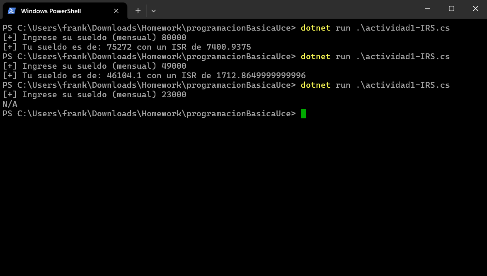

# Proyectos de Consola C# (Actividades 1 y 2)

Este repositorio contiene dos herramientas esenciales desarrolladas en C# para la automatización de cálculos financieros y académicos en el contexto de la **República Dominicana (2026)**.

---

##  Contenido del Repositorio

### 1. Calculadora de ISR 2026 (RD) 🇩🇴

Un programa diseñado para calcular de forma precisa el **Impuesto Sobre la Renta (ISR)** para empleados asalariados, siguiendo las normativas vigentes de la DGII.

- **¿Qué hace?**
    
    - Valida entradas numéricas para evitar errores de ejecución.
        
    - Aplica los descuentos obligatorios de Seguridad Social (TSS: AFP y SFS).
        
    - Calcula el excedente según las tres escalas impositivas (15%, 20% y 25%).
        
    - Muestra el sueldo neto real tras todos los descuentos.
        
- **Uso:** Ejecuta el programa e ingresa tu sueldo bruto mensual cuando se te solicite.


### 2. Gestor de Notas Estudiantiles 

Una herramienta de gestión académica que procesa múltiples estudiantes y sus respectivas calificaciones utilizando arreglos multidimensionales.

- **¿Qué hace?**
    
    - Permite definir la cantidad de estudiantes a registrar.
        
    - Captura el nombre y 4 notas individuales por cada alumno.
        
    - Calcula automáticamente el promedio final.
        
    - Determina el estatus académico (**Aprobado** $\ge 70$ / **Reprobado** $< 70$).
        
    - Presenta los resultados en una tabla organizada y fácil de leer.
        
- **Uso:** Indica cuántos estudiantes deseas registrar y sigue las instrucciones en pantalla para llenar sus datos.


---

## Requisitos Técnicos

- **.NET SDK** (Versión 6.0 o superior recomendada).
    
- Un IDE o editor de texto (VS Code, Visual Studio, o incluso el fiel **NvChad** si te sientes valiente).
    

##  Cómo Ejecutar

1. Clona este repositorio o copia los archivos `.cs`.
    
2. Abre tu terminal en la carpeta del proyecto.
    
3. Ejecuta el comando:
    
    Bash
    
    ```
    dotnet run
    ```
